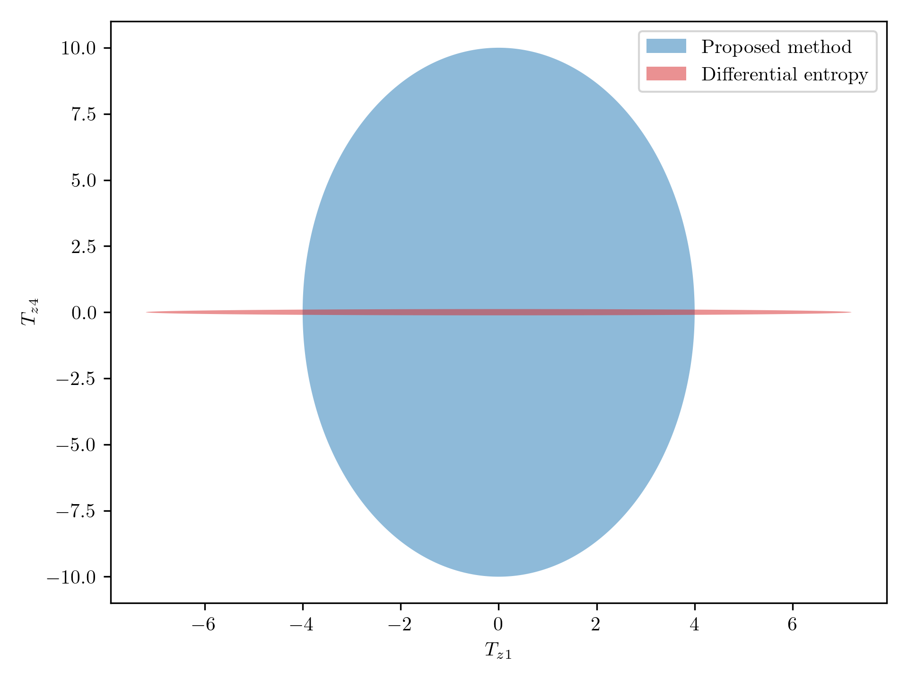
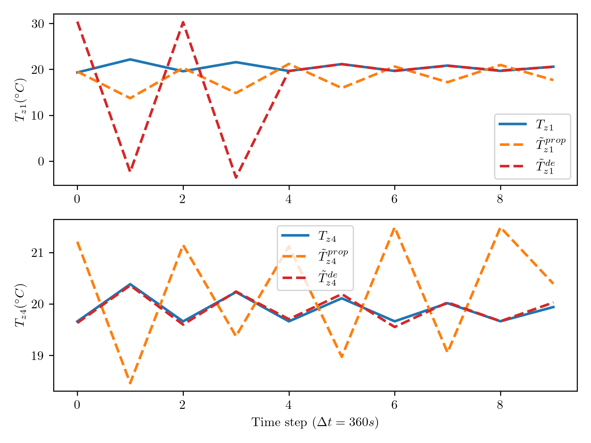

# Repository for "Gaussian Mechanism Design  in Data Releasing Systems"

The repository for the paper **"Gaussian Mechanism Design for Prescribed Privacy Sets in Data Releasing Systems."** The paper is available on [Google Scholar](https://scholar.google.com/citations?hl=en&user=PjrYo48AAAAJ&view_op=list_works&sortby=pubdate).

The note book main produces the results for the simulation section of the paper. 

Confusion set 10 for the worst adversary with $\gamma = 1$. We have shifted $\hat{x}_0$ to $0$ to make the comparison simpler.

The true values of the measured temperatures and their private versions using the proposed method
(28) and (33)
## Dependencies

This project primarily uses [CVXPY](https://www.cvxpy.org/) as the main solver, with [MOSEK](https://www.mosek.com/) as the backend for solving optimization problems. Make sure to have these installed and properly configured.

---

Feel free to explore the notebooks, and don't hesitate to reach out if you have any questions!
